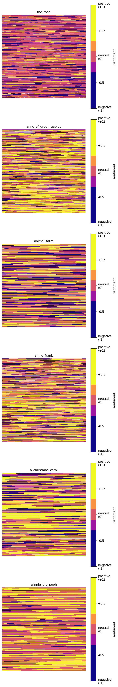

+++
date = '2026-05-22T00:00:00+11:00'
draft = true
title = 'The Emotional Shape of Books'
slug = 'emotional-shape-of-books'
summary = 'Compressing whole novels into single coloured grids using per-sentence sentiment analysis. Inspired by Adam Calhoun.'
weight = 1
+++

A while back I read [this article by Adam J Calhoun](https://medium.com/@neuroecology/punctuation-in-novels-8f316d542ec4), where he stripped the words out of famous novels and left only the punctuation. Each book turned into a strange little visual fingerprint of its author's style. I loved it.

I wanted to try the same trick but with a different question. Not how an author writes, but how a book *feels*. Where are the dark patches, where are the bright ones, and what does the emotional shape of an entire novel look like at a glance?

So I built this.

**What you're looking at**

Each square is one whole book. Every character of text is one pixel, coloured by the sentiment of the sentence that character belongs to. Bright yellow is positive, deep purple is negative, with a thin band of magenta, pink, and orange in between for everything in the middle.

You read each grid left-to-right, top-to-bottom, same as a page of English. The upper-left is the start of the book, the lower-right is the end.

**How it was built**

About a hundred lines of Python. The pipeline is short and dumb on purpose:

1. Read the book as plain text.
2. Split it into sentences with NLTK.
3. Score each sentence with [VADER](https://github.com/cjhutto/vaderSentiment), a rule-based sentiment analyzer that gives you a number from -1 (very negative) to +1 (very positive).
4. Build a flat array where every character of every sentence gets that sentence's score. A 200-character negative sentence contributes 200 negative values.
5. Pad the array out to a perfect square and reshape it into a 2D grid.
6. Render the grid as a heatmap with a custom plasma colormap, anchored to [-1, +1] so the colours are directly comparable across every book.

**Two ends of the spectrum**

I picked two books on purpose so the colours have something to anchor against.

**Winnie-the-Pooh** is the yellowest grid. It's one of the most cheerful books ever written, and the picture knows it. There's almost no purple in there at all.

**The Road** by Cormac McCarthy is the darkest. Post-apocalyptic, sparse, bleak, and the colours don't pretend otherwise. The purple runs nearly the entire length of the book.

Everything else sits between those two. *A Christmas Carol* visibly shifts as Scrooge changes. *Anne Frank's diary* flickers between hope and dread. *Animal Farm* darkens as the story rolls toward its ending. *Anne of Green Gables* stays warm and bright, sitting closer to Pooh than anything else here.

**References**

- The Road : Cormac McCarthy
- Anne of Green Gables : L. M. Montgomery
- Animal Farm : George Orwell
- The Diary of a Young Girl : Anne Frank
- A Christmas Carol : Charles Dickens
- Winnie-the-Pooh : A. A. Milne

Original inspiration: ["Punctuation in Novels" by Adam J Calhoun](https://medium.com/@neuroecology/punctuation-in-novels-8f316d542ec4).
